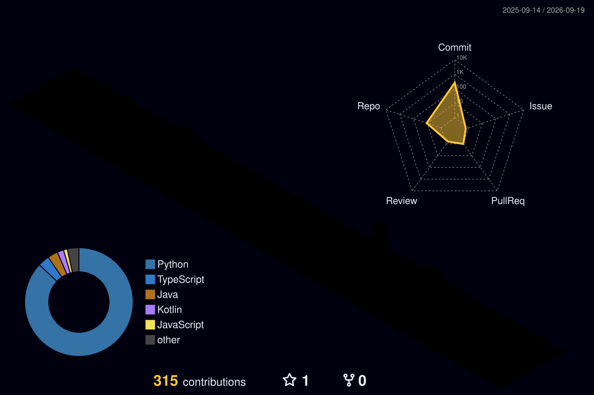

<!-- Typing Animation -->
<p align="center">
  
</p>

<p align="center">
  <a href="https://www.linkedin.com/in/mukunthgopi/" target="_blank">
    
  </a>
  <a href="https://github.com/muku2006nth" target="_blank">
    
  </a>
  <a href="https://www.instagram.com/_.muk.404.error._/" target="_blank">
    
  </a>
</p>

---

# 👨‍💻 About Me

I'm **Mukunth Gopi**, a **Computer Science undergraduate (CGPA: 9.05/10)** passionate about **Software Engineering, AI/ML, and Full-Stack Development**.

I enjoy building scalable applications—from backend APIs to AI-powered systems—and continuously learning modern technologies through real-world projects and internships.

### 🚀 Current Interests

- 🤖 Artificial Intelligence & LLM Applications
- ⚡ FastAPI & Backend Engineering
- 🌐 Full Stack Development (React + Node.js)
- ☁️ Cloud Computing & DevOps
- 📱 Mobile Application Development

> *Learning by building. Improving with every project.*

---

# 🛠️ Tech Stack

### Languages

<p align="center">
  
</p>

### Frameworks & Technologies

<p align="center">
  
</p>

### Databases & Cloud

<p align="center">
  
</p>

### AI / ML

- PyTorch
- Scikit-learn
- NumPy
- Pandas
- Hugging Face Transformers
- LLMs
- RAG
- NLP
- Agentic AI

---

# 💼 Experience

### 🤖 AI Engineer Intern — TSI Software (2026)

- Built AI-powered backend services using **Python, FastAPI & LLM integrations**
- Worked on enterprise AI workflows and scalable backend systems
- Collaborated with senior engineers on production-ready applications

### 📱 Software Development Intern — Senchola Technologies (2025)

- Developed the **Amico Chit Funds** Android application using Kotlin
- Automated workflow management using **n8n**
- Built production-ready features and internal automation tools

---

# 🚀 Featured Projects

### 🔐 Vigil Dev — AI Vulnerability Detection

- Fine-tuned CodeBERT on **27K+ samples**
- Integrated Semgrep + RAG + LLaMA 3
- FastAPI + React dashboard
- Detects multiple vulnerability classes

---

### 👁️ Diabetic Retinopathy Prediction

- CNN + Transfer Learning
- FastAPI + React
- Automated medical report generation

---

### 🌍 EVAC Platform

- AI-powered disaster response system
- A* & Dijkstra pathfinding
- React + Leaflet.js
- Live evacuation routing

---

# 📊 GitHub Stats

<p align="center">
  
</p>

---

# 🗓️ 3D Contribution Calendar

<p align="center">
  
</p>

---

# 👁️ Visitor Counter

<p align="center">
  
</p>

---

# 📫 Connect With Me

<p align="center">
  <a href="mailto:mukunthgopi@gmail.com">
    
  </a>

  <a href="https://www.linkedin.com/in/mukunthgopi/">
    
  </a>

  <a href="https://github.com/muku2006nth">
    
  </a>

  <a href="https://www.instagram.com/_.muk.404.error._/">
    
  </a>
</p>

---

<p align="center">
  <b>⭐ Thanks for visiting my profile! ⭐</b>
</p>
```
